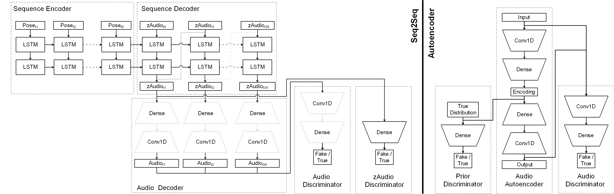

# Raw Music From Free Movements

[Project Page](https://ktatar.github.io/rawmusicfromfreemovements/ "Project Page")

Daniel Bisig - Coventry University, UK - [daniel.bisig@zhdk.ch](daniel.bisig@zhdk.ch)

Kıvanç Tatar - Chalmers University of Technology, Sweden - [info@kivanctatar.com](info@kivanctatar.com) 

Best Paper Award at [AIMC 2021](https://aimc2021.iem.at)

## Abstract

Raw Music from Free Movements is a deep learning architecture that translates pose sequences into audio waveforms. The architecture combines a sequence-to-sequence model generating audio encodings and an adversarial autoencoder that generates raw audio from audio encodings. Experiments have been conducted with two datasets: a dancer improvising freely to a given music, and music created through simple movement sonification. The paper presents preliminary results. These will hopefully lead closer towards a model which can learn from the creative decisions a dancer makes when translating music into movement and then follow these decisions reversely for the purpose of generating music from movement.

## Implementation

## Examples

Two different datasets were employed for training, named improvisation dataset and sonification dataset. The improvisation dataset consists of pose sequences and audio that have been recorded while a dancer was freely improvising to a given music. The dancer is an expert with a specialisation in contemporary dance and improvisation. The music consists of short excerpts of royalty free music including experimental electronic music, free jazz, and contemporary classic. The pose sequences have been acquired using the markerless motion capture system (The Captury ) in the iLab at MotionBank, University for Applied Research, Mainz. The recording is 10 minutes in length which corresponds to a sequence of 30000 poses. Each pose consists of 29 joints whose relative orientations are represented by quaternions.

The sonification dataset contains the same pose sequences as the improvisation dataset. The audio of this dataset was created afterwards, through sonification, employing a very simple sound synthesis consisting of two sine oscillators controlled by the dancer’s hands. The frequency and amplitude of each oscillator are proportional to the height and velocity of the corresponding hand, respectively. The authors created this dataset to verify the performance of RAMFEM.

## Resources

- Code: [Bitbucket](https://bitbucket.org/dbisig/rawmusicfromfreemovements/src/master/)

- Paper: [AIMC 2021](https://aimc2021.iem.at/wp-content/uploads/2021/06/AIMC_2021_Bisig_Tatar.pdf)

- Supplementary Materials (Datasets + Code in Paper + Examples): [Zenodo](https://zenodo.org/record/4656086)
  